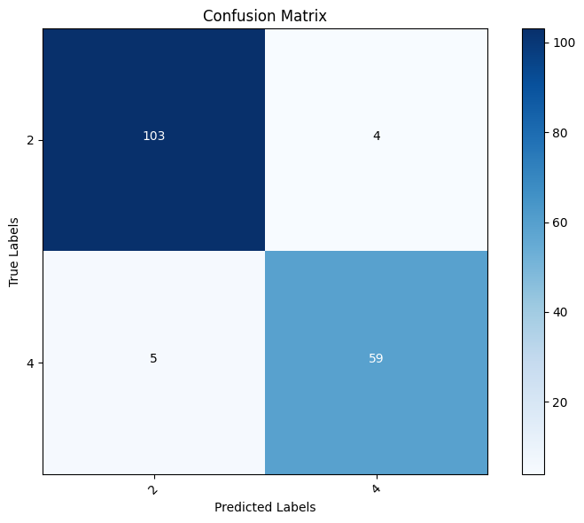
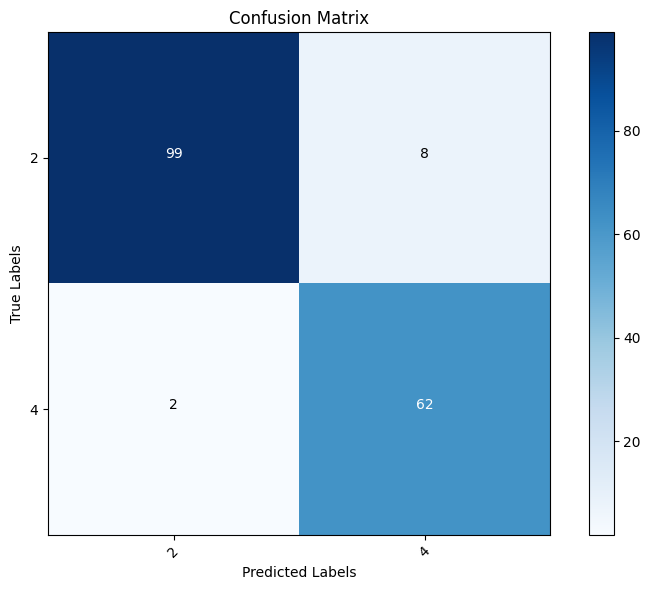

# Cancer Prediction Models

## Description
This project contains prediction using different machine learning classification alogrithms of whether the human cells in the given data are benign or malignant. 
Benign cells means that the cell is not cancerous, malignant cell means the cells are cancerous.
I have listed the performance of all the models, based on which we can decide which model to use for such use cases.

Following is the visualisation of all the models:

### Decision Tee
Model Accuracy Score is : 95.906%

### Logistic Regression
Model Accuracy Score is : 94.736%

### Support Vector
Model Accuracy Score is : 94.152%

### Support Vector with a different kernel
Model Accuracy Score is : 95.321%

### Naive Bayes
Model Accuracy Score is : 94.152%

### Random Forest
Model Accuracy Score is : 93.567%

### K-Nearest Neighbours
Model Accuracy Score is : 94.736%

***Since the accuracy score of Decision Tree is the most. It is the best suited model for such type of predictions.***

